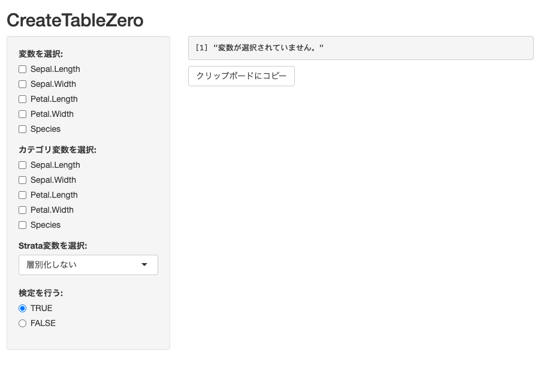
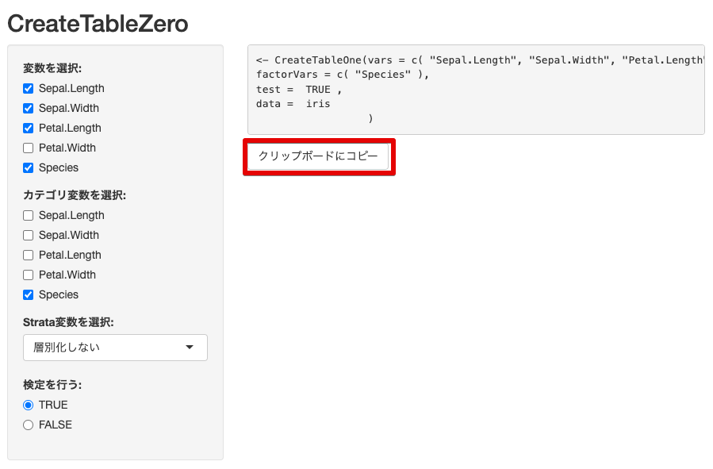

# CreateTableZero
CreateTableOneの引数を作成するShiny Appです

RのTableOne packageはとても便利なpackageですが、CreateTableOne()を使用する際に、引数を指定するのがやや面倒です。
そこで、データフレームを指定したら変数を列挙してくれて、ポチポチクリックで引数を作れるShiny appを作ってみました。

## 準備
CreateTableZero.Rをワーキングディレクトリに置いてください
（パスの指定ができれば、必ずしもワーキングディレクトリではなくても良いです）

使用するスクリプトからSource("CreateTableZero.R")を実行すると、上記のファイルが読み込まれ、CreateTableZeroが使えるようになります

## irisを使用してTableOneを作成する
irisのデータを使って、TableOneを作ってみましょう

CreateTableZero(iris)　を実行するとShinyが立ち上がります。

左側のカラムの必要な変数をポチポチクリックすると、右上に引数が作成されていきます。

「クリップボードにコピー」ボタンを押すとコードがコピーされます。

Shiny appを閉じて、コードに戻り、ペーストするとCreateTableOneが出来上がります
Shinyを閉じないとコードが実行できないので、ご注意ください。
